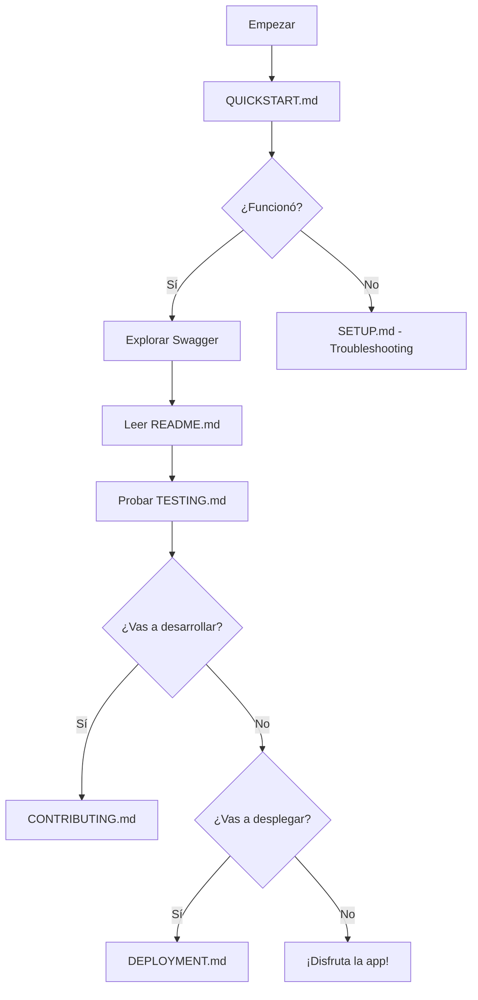

# 📖 Índice de Documentación - Star Wars API

## 🎯 ¿Por Dónde Empezar?

### Para Usuarios Nuevos

1. **⚡ [QUICKSTART.md](QUICKSTART.md)** - Inicio rápido en 5 minutos
   - La forma más rápida de ver la aplicación funcionando
   - Solo necesitas Docker

2. **📖 [README.md](README.md)** - Documentación completa
   - Descripción detallada del proyecto
   - Características y tecnologías
   - Guía de uso completa

3. **🔧 [SETUP.md](SETUP.md)** - Guía de configuración detallada
   - Instalación paso a paso
   - Configuración local y con Docker
   - Solución de problemas

### Para Desarrolladores

4. **🧪 [TESTING.md](TESTING.md)** - Guía de testing
   - Pruebas manuales y automatizadas
   - Casos de prueba
   - Scripts de testing

5. **🤝 [CONTRIBUTING.md](CONTRIBUTING.md)** - Guía de contribución
   - Cómo contribuir al proyecto
   - Estándares de código
   - Proceso de Pull Request

### Para DevOps/Deployment

6. **🚀 [DEPLOYMENT.md](DEPLOYMENT.md)** - Guía de despliegue
   - Despliegue en Docker Compose
   - Azure App Service
   - AWS ECS
   - Kubernetes

### Para Project Managers

7. **📊 [PROJECT_SUMMARY.md](PROJECT_SUMMARY.md)** - Resumen ejecutivo
   - Estado del proyecto
   - Características implementadas
   - Estadísticas
   - Puntos destacados

## 📁 Estructura de Archivos

### Documentación Principal

| Archivo | Descripción | ¿Para quién? |
|---------|-------------|--------------|
| [QUICKSTART.md](QUICKSTART.md) | Inicio en 5 minutos | Todos |
| [README.md](README.md) | Documentación completa | Todos |
| [SETUP.md](SETUP.md) | Configuración detallada | Usuarios/Dev |
| [TESTING.md](TESTING.md) | Guía de testing | Desarrolladores |
| [CONTRIBUTING.md](CONTRIBUTING.md) | Cómo contribuir | Desarrolladores |
| [DEPLOYMENT.md](DEPLOYMENT.md) | Guía de despliegue | DevOps |
| [PROJECT_SUMMARY.md](PROJECT_SUMMARY.md) | Resumen ejecutivo | PM/Stakeholders |
| [INDEX.md](INDEX.md) | Este archivo | Todos |

### Código Fuente

```
src/
├── StarWars.Domain/          # Entidades del dominio
├── StarWars.Application/     # Interfaces y lógica de negocio
├── StarWars.Infrastructure/  # Implementaciones (DB, SWAPI, Servicios)
├── StarWars.Api/            # Web API REST
└── StarWars.Client/         # Aplicación cliente de consola
```

### Configuración

```
├── docker-compose.yml       # Orquestación de contenedores
├── Dockerfile              # Imagen Docker de la API
├── .dockerignore           # Archivos ignorados por Docker
├── .gitignore              # Archivos ignorados por Git
├── .editorconfig           # Configuración de editor
└── LICENSE                 # Licencia MIT
```

### Scripts

```
scripts/
├── start.ps1               # Script de inicio (Windows)
├── start.sh                # Script de inicio (Linux/Mac)
└── init-db.sql            # Script de inicialización de DB
```

### Tests

```
tests/
└── integration-tests.http  # Tests HTTP para VS Code/JetBrains
```

## 🎓 Guías por Escenario

### Escenario 1: "Quiero ver la aplicación funcionando AHORA"

➡️ [QUICKSTART.md](QUICKSTART.md)

```bash
docker-compose up -d
# Abre http://localhost:5000
```

### Escenario 2: "Quiero entender qué hace la aplicación"

➡️ [README.md](README.md) (sección: Características)

- Integración con SWAPI
- Sistema de favoritos
- Historial de peticiones
- Caché multinivel
- Rate limiting

### Escenario 3: "Quiero desarrollar/contribuir"

➡️ [CONTRIBUTING.md](CONTRIBUTING.md)

1. Fork del repositorio
2. Configurar entorno local
3. Seguir estándares de código
4. Crear Pull Request

### Escenario 4: "Quiero desplegarlo en producción"

➡️ [DEPLOYMENT.md](DEPLOYMENT.md)

Opciones:
- Docker Compose
- Azure App Service
- AWS ECS
- Kubernetes

### Escenario 5: "Quiero probar/testear la API"

➡️ [TESTING.md](TESTING.md)

- Swagger UI: http://localhost:5000
- cURL examples
- Cliente de consola
- Scripts automatizados

### Escenario 6: "Tengo un problema"

➡️ [SETUP.md](SETUP.md) (sección: Solución de Problemas)

Problemas comunes:
- Puerto ocupado
- Docker no responde
- Base de datos no conecta
- API no inicia

## 📊 Endpoints Rápidos

### Characters (Personajes)
- `GET /api/v1/characters` - Listar
- `GET /api/v1/characters/{id}` - Obtener por ID
- `GET /api/v1/characters/search?name={name}` - Buscar

### Favorites (Favoritos)
- `GET /api/v1/favorites` - Listar
- `POST /api/v1/favorites` - Agregar
- `DELETE /api/v1/favorites/{id}` - Eliminar

### History (Historial)
- `GET /api/v1/history` - Ver historial
- `GET /api/v1/history/statistics` - Estadísticas

### Health
- `GET /health` - Health check

## 🛠️ Comandos Rápidos

### Iniciar
```bash
# Windows
.\scripts\start.ps1

# Linux/Mac
chmod +x scripts/start.sh
./scripts/start.sh

# Manual
docker-compose up -d
```

### Detener
```bash
docker-compose down
```

### Ver Logs
```bash
docker-compose logs -f starwars-api
```

### Limpiar Todo
```bash
docker-compose down -v
```

### Cliente de Consola
```bash
cd src/StarWars.Client
dotnet run
```

## 🎯 Checklist Rápido

### Para Evaluadores Técnicos

- [ ] Leer [PROJECT_SUMMARY.md](PROJECT_SUMMARY.md)
- [ ] Ejecutar [QUICKSTART.md](QUICKSTART.md)
- [ ] Probar endpoints en Swagger
- [ ] Revisar código en `src/`
- [ ] Verificar [TESTING.md](TESTING.md)

### Para Usuarios Finales

- [ ] Leer [QUICKSTART.md](QUICKSTART.md)
- [ ] Iniciar con Docker
- [ ] Explorar Swagger UI
- [ ] Probar cliente de consola

### Para Desarrolladores

- [ ] Leer [README.md](README.md)
- [ ] Leer [CONTRIBUTING.md](CONTRIBUTING.md)
- [ ] Configurar entorno local
- [ ] Revisar arquitectura del código

## 📞 Links Útiles

| Recurso | URL |
|---------|-----|
| Swagger UI | http://localhost:5000 |
| Health Check | http://localhost:5000/health |
| API Base | http://localhost:5000/api/v1 |
| SWAPI Original | https://swapi.dev |

## 🎓 Tecnologías Utilizadas

- **.NET 8** - Framework principal
- **PostgreSQL** - Base de datos
- **Entity Framework Core** - ORM
- **Docker** - Containerización
- **Swagger/OpenAPI** - Documentación
- **AspNetCoreRateLimit** - Rate limiting
- **SWAPI** - Star Wars API externa

## 📝 Notas Importantes

### Puertos Usados

- **5000**: API (HTTP)
- **5432**: PostgreSQL

### Credenciales por Defecto

- **DB User**: starwars
- **DB Password**: starwars123
- **DB Name**: starwarsdb

⚠️ **IMPORTANTE**: Cambiar en producción

### Requisitos del Sistema

- Docker Desktop
- 2GB RAM mínimo
- 5GB espacio en disco

## 🌟 Características Destacadas

✅ **Arquitectura Limpia** - Separación de responsabilidades  
✅ **Caché Inteligente** - Multinivel (memoria + DB)  
✅ **Rate Limiting** - Protección contra abuso  
✅ **Health Checks** - Monitoreo de servicios  
✅ **Documentación Completa** - 8 archivos MD + Swagger  
✅ **Cliente Interactivo** - Consola con menú  
✅ **Docker** - Despliegue simple  
✅ **Testing** - Guías completas  

## 🎯 Próximos Pasos Sugeridos

1. **Inmediato**: Ejecutar [QUICKSTART.md](QUICKSTART.md)
2. **Después**: Explorar Swagger UI
3. **Luego**: Probar cliente de consola
4. **Finalmente**: Leer documentación completa

## 🆘 ¿Necesitas Ayuda?

1. **Revisa la documentación**: Probablemente está explicado aquí
2. **Busca en los archivos MD**: Usa Ctrl+F
3. **Revisa los logs**: `docker-compose logs -f`
4. **Abre un Issue**: Si encuentras un bug

## 📜 Licencia

MIT License - Ver [LICENSE](LICENSE)

---

## 🎬 Flujo Recomendado



---

**¡Bienvenido al proyecto Star Wars API!** 🌟

**May the Force be with you!** 🚀

